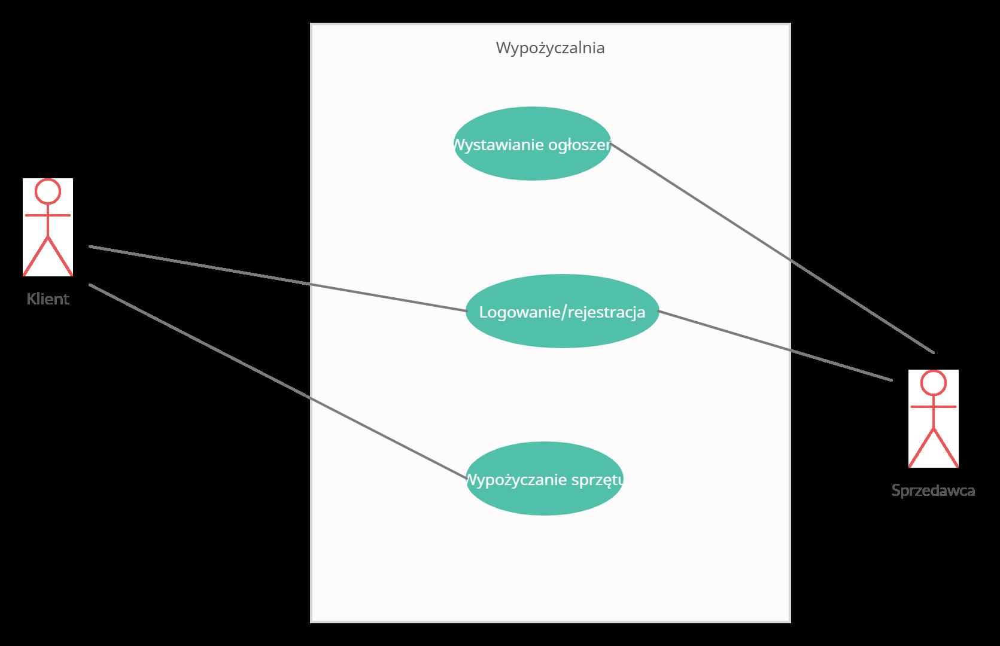

# Specyfikacja dot. wyszukiwarki i strony przedmiotu w aplikacji _Wypożyczalnia elektronarzędzi_

### 1. Ogólny opis wymagań.  
    1.1 Celem projektu jest zaprojektowanie strony wyszukiwarki, i jej działania, jest to także nasza strona główna. Także do zaprojektowania jest strona przedmiotu i jej działanie.

### 2.  Użyta technologia oraz środowisko pracy  
    
  
  | Technologia        | Środowisko   |
| ------------- |:-------------------:|
| 1. C#   |VisualStudioCode |
| 2.  Baza Danych MySQL 5  | SglMenagmentServer        |
| 2.Markdown|VScode        |
| 3.Dane dostępowe|     SglMenagmentServer   |
|   dostęp do bazy danych|     SglMenagmentServer   |

### 3.  Definicja i słownik pojęc.  
    -  Klient – osoba, która korzysta z systemu.
	  - System – program, który ma za zadanie ułatwić pracę
    firmy.
    

  

### 4.  Diagram przypadków użycia. 
  

   ### 4.1 Wnioski na podstawie diagramu przypadków użycia.  
     Na diagramie widać jak ma odbywać się komunikacja między __klientem__ a __sprzedawcą__.
     Klient korzysta z funkcji opisanych jako _Wypożyczanie sprzętu_ a także _Logowanie/rejestracja_ natomiast nie ma dostępu do _Wystawiania ogłoszeń_.

### 5. Wymagania funkcjonalne 

| ID        | Identyfikator wymagania                                                                   |
|-----------|-------------------------------------------------------------------------------------------|
| Nazwa     | Strona wyszukiwania                                                                       |
| Priorytet | Wysoki                                                                                    |
| Rola      | Wszyscy                                                                                   |
| Opis      | Każdy użytkownik (klient) może wyszukiwać narzędzia po kategori i nazwie, lub samej kategori czy samej nazwie, dodatkowo może zaznaczyć, aby pokazywało mu tylko przedmioty, które są dostępne w interesującym go czasie, po naciśnięciu na jeden z wyświetlonych przedmiotów przekierowywuje klienta na stronę danego przedmiotu. |   

  
  | ID        | Identyfikator wymagania                                                                                                                                                        |
|-----------|--------------------------------------------------------------------------------------------------------------------------------------------------------------------------------|
| Nazwa     | Strona przedmiotu                                                                                                                                                           |
| Priorytet | Wysoki                                                                                                                                                                         |
| Rola      | Wszyscy                                                                                                                                                                        |
| Opis      | Wyświetla wszystkie dane jednego urządzenia oraz jego zdjęcie. Z tej strony można cofnąć się do wyszukiwarki. Pokazuje nam także podstawowe dane osoby wynajmującej. |  
  
    
    

### 6.  Wymagania niefunkcjonalne 
    5.1 System powinen łączyć się z zewnętrzną bazą danych aby wszystkie dane były wyświetlane na stronach.
